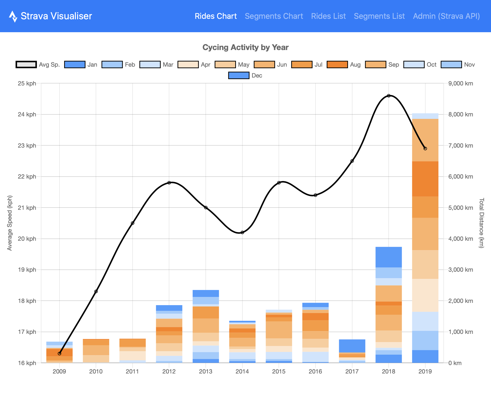
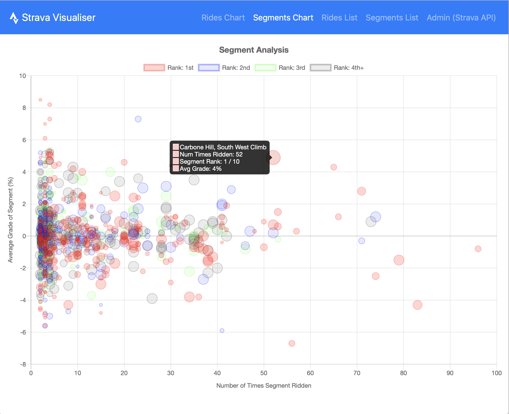
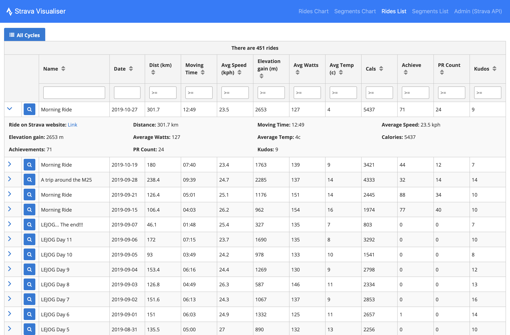
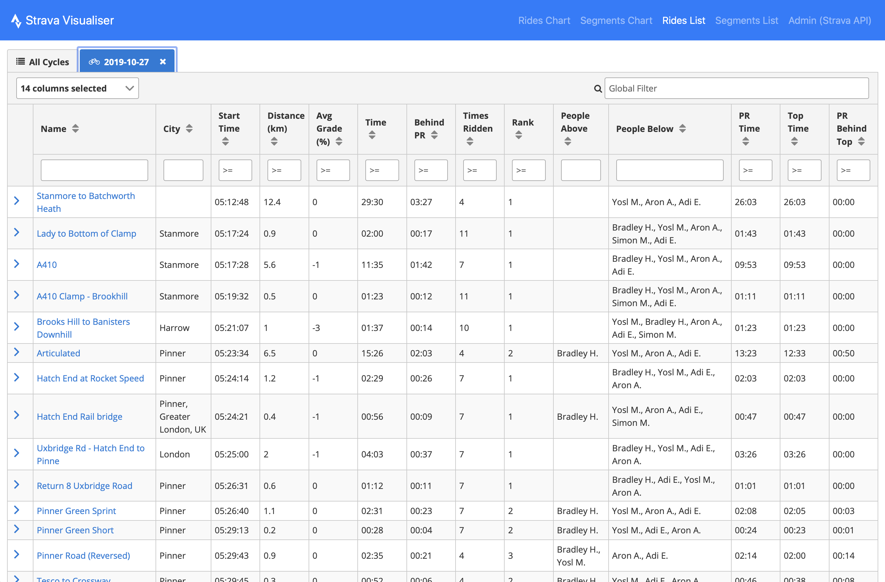
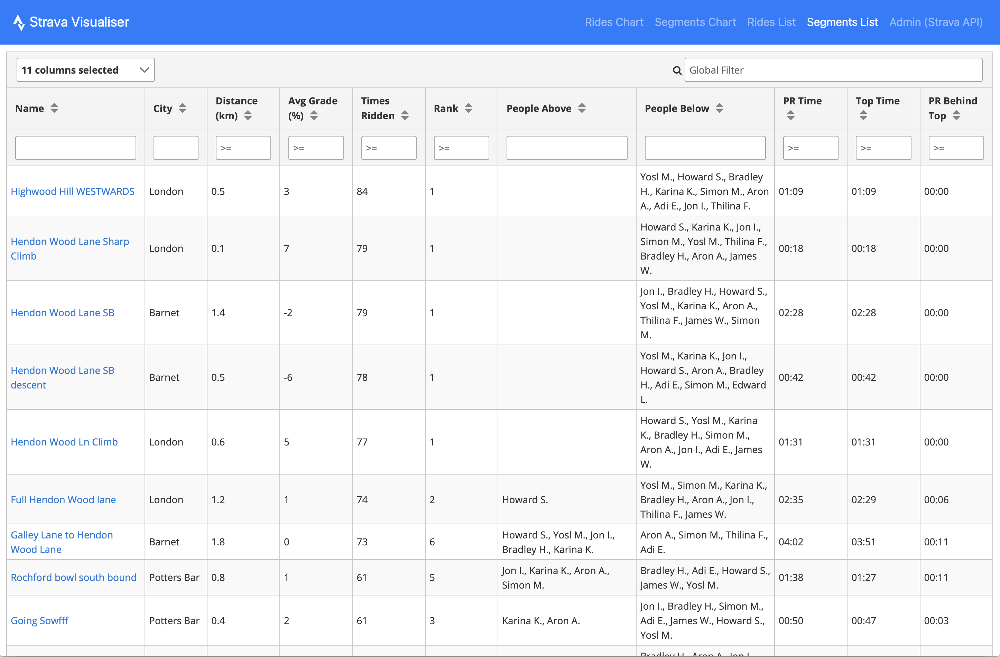

# Strava Visualiser (strava-visualiser)

## Functionality

Allows the user to visualise and analyse Strava rides using charts and tables. The user can see an overview of rides and segments and drill down into the detail of that data (including flexibly sorting and filtering). This project solves a real gap in the functionality currently offered by Strava and other 3rd party developers. The site currently only visualises my rides, but I would like to extend this in the future to work for any Strava user.

## Learning

The goal of this project was to be able to visualise, summarise and analyse the details of all my rides for the last 10 years based on Strava data. Strava offers several APIs to expose all the data that I required - details of each ride, the segments ridden on those rides and the leaderboards for each segment comparing my performance on a given segment with that of my friends.

However, it would not have been possible to provide the type of data analysis that I wanted by just interactively querying the APIs on demand. To get all the data I needed, I had to make a total of over 20,000 API calls (one per ride and two per segment). This would have been too slow to do every time the user wanted to view the data and would also have hit Strava API call limits (600 every 15 minutes). I solved this problem by building functionality to call the Strava API for this data ahead of time and save it into a Google Firestore NoSQL database.

The project was built using Angular 8. All the visual parts of the project are broken down into Angular components - Nav Bar, Rides Chart, Segments Chart, Rides List, Ride Drill Down List, Segment Performance List. I wrote serval Angular services to provide the data required by the components. Each service had a specialist and separate job, encapsulating specific functionality and keep the overall application logic clean.

As mentioned above, a Google Firestore database was used to persist information gathered from multiple calls to the Strava API. In addition, due to the large amount of data involved, a local caching solution (IndexedDB) was used to improve performance to the user. This turns a 5-10 second query (retrieving the details of 6000+ segments) into an instant response for subsequent calls.

Finally, I used the PrimeNG Angular component library and Chart.js to facilitate rich charting and table functionality. I used a stacked bar chart for the rides and a bubble chart for the segments. There are three different tables in the system (rides, ride segment drill down and ride segment performance) each offering individual column filtering, reordering, sorting.

## Screenshots

### Rides Chart

### Segments Chart

### Rides List

### Rides List Drill Down

### Segments List

